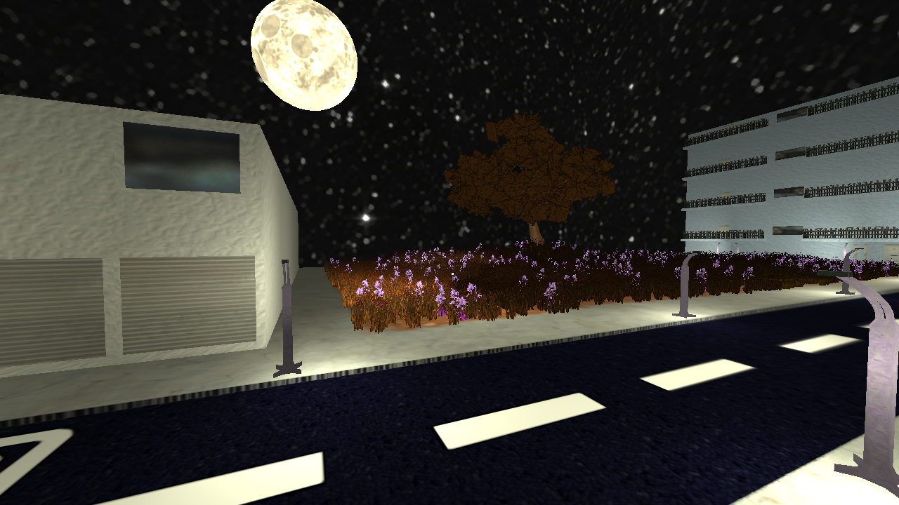

# CGFinal-A_Calm_Neighborhood

A simple project that worked as the last practical exam of my Computer Graphics course 
where it was required that a project contained at least the principles of OpenGL's graphics rendering pipeline,
which are comprised of: 
* `Lighting` (in its static form, shadows not required),
* `Shading` (gouraud or phong, implemented in shaders)
* `Texturing`
* `Camera` (to look around the environment)

 
I decided to go the extra mile and also implemented multiple light types,
moving lights, a skybox, a ton of static lights, vertex shaders that allow
the renderer to manipulate a gigantic amount of grass blades and tree leaves
without tanking performance and also implemented a lighting model closer to PBR
through shaders that support specular, height, emission and normal maps besides
the default diffuse texture. (maybe a few other things, but i can't remember).

I'm sure a lot of optimizations could be done to make it render much faster,
but this project was a sole effort and had around one month of development time
so compromises had to be made.

# So, how does one compile such a project?

Since this is the windows branch, a lot of dependencies are already in the repository, including the dlls for less hassle... and also because i started using linux as my main OS long before i decided to put this project here, so it would take a long time to redo everything on windows and check for incompatibilities. Due to that, while it's "easier" to compile it on windows, i can guarantee it'll work

Basically, you will need the following extra dependencies to compile it: 

* Code::Blocks IDE, since it's the one i used to set up the project.
* TDM-GCC or Code::Blocks internal GCC compiler 
* A graphics card with support for OpenGL4.3 and at least 256MB of VRAM.

While the GL 4.3 requirement is a bit high for such a project, you can set the version as low as 3.3 in the main.cpp file and not face any major problems.

Having all of those in hand, you just need to load up the project in the IDE on your windows installation, link glfw3 and libassimp by right-clicking the "CG-Final" project in the left side dropdown, going to "Build options->Linker settings" andd adding them in the "link libraries menu" if needed, compile it (hopefully shouldn't bring up any problems since i'm unable to fix them now and it's been a while since i even opened this version of the project), and it will give you a .exe in Compiled/bin/Release. Note that it will be alogside a libassimp.dll, so get those 2 files and paste them in the root of the project, alongisde the project's .cbp and it should execute fine. There's a cmd window besides the main render one in case you get no 3D graphics, so you can look for info there. You can also Compile and Run it right from the Code::Blocks window.

# After having the project running, there's some ways to control it

It will capture your mouse by default, but you can alt+tab to remove it's focus. The following keys are used by the camera:

* WASD -> Movement
* Shift -> Move faster
* Ctrl -> "Crouch" (basically, move slower, i was trying to make a mini game at the start)
* Esc -> Exit
